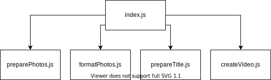

# Introdução
Princípio da Responsabilidade Única (*Single Responsibility Principle*) é um dos 5 princípios do S.O.L.I.D - acrônimo criado por Michael Feathers. Estes princípios tem com objetivo ajudar ao desenvolvedores a como escrever códigos mais legíveis; facilitando na refatoração, evitando a criação de uma "classe Deus", diminuindo acoplamentos, etc.

o _SPR_ (**Single Responsibility Principle**) diz que uma classe deve ter um, e somente um, motivo para mudar - ou seja, a classe deve ter uma única tarefa para executar.
> "[A class should have only one reason to change](https://en.wikipedia.org/wiki/Single-responsibility_principle#cite_note-cleancode-1)" - Robert C. Martin

# Exemplo

Para entender melhor a importância do _SPR_, imagine que você está criando uma aplicação com os seguintes requisições:
- Como _pessoa que irá assistir_, quero ter um vídeo a partir de uma sequência de imagens, porque desejo ter a recordações desses momentos;
- Como _pessoa que irá assistir_, desejo que o vídeo esteja em ordem cronológica, porque quero ver as mudanças das pessoas ao longo do tempo;
- Como _pessoa que irá assistir_, desejo que tenham transições entre as fotos de modo que torne a apresentação mais agradável;
- Como _pessoa que irá assistir_, desejo tenha algo que indique o mês e ano em que da foto, porque quero ter uma noção melhor de quando é aquele acontecimento;
- Como _pessoa que irá gerar o vídeo_, desejo que o programa organize automaticamente as fotos, porque não quero ter de fazer isso manualmente;
- Como _pessoa que irá gerar o vídeo_, desejo que o programa me deixe verificar se as fotos estão organizadas corretamente, porque algumas fotos podem estar com a data errada;
- Como _pessoa que irá gerar o vídeo_, desejo que o programa possibilite que eu crie um título para o início do vídeo, porque quero poder colocar frases marcantes para a linha do tempo;
- Como _pessoa que irá gerar o vídeo_, desejo que o programa pergunte onde estão as fotos e onde quero que seja salvo o vídeo, para que eu não tenha de me preocupar em sempre colocar as fotos na mesma pasta;

## Mão na massa
Então a gente começa com a mão na massa fazendo o seguinte código:

```js
const prompts = require('prompts')
const fs = require('fs')
const gm = require('gm').subClass({ imageMagick: true })
const concat = require('ffmpeg-concat')
const videoshow = require('videoshow')
const moment = require('moment')

moment.locale('pt-br')

const videoOptions = {
  fps: 25,
  loop: 2, // seconds
  transition: true,
  transitionDuration: 1, // seconds
  videoBitrate: 1024,
  videoCodec: 'libx264',
  size: '720x480',
  audioBitrate: '128k',
  audioChannels: 2,
  format: 'mp4',
  pixelFormat: 'yuv420p'
}

const transitions = {
  year: {
    name: 'fade',
    duration: 1000
  },
  month: {
    name: 'crosszoom',
    duration: 1000
  },
  main: {
    name: 'directionalwarp',
    duration: 1000
  }
}


async function generateVideo() {
  async function handleInput() {
		const questions = [
			{
				type: 'text',
				name: 'imageFolder',
				message: 'Which is the image folder path?',
				initial: 'images'
			},
			{
				type: 'text',
				name: 'outputFolder',
				message: 'Which is the output path?',
				initial: 'output'
			},
			{
				type: 'text',
				name: 'title',
				message: 'Which is the title of the video?'
			},
			{
				type: 'confirm',
				name: 'waitUser',
				message:
					'Do you want to wait for your confirmation before generating the video?',
				initial: false
			}
		]

    const response = await prompts(questions)
    return response
  }

  const response = await handleInput()

	async function preparePhotos(inputDir,outputDir) {
    function listFiles (dir) {
      // List files inside the directory
    }

    function autoRotateResizeAndConvertToJpeg (file, outputFileName) {
      // Autorotate, resize images to 720 and convert to jpeg
    }

    const files = listFiles(inputDir)
    const editedFiles = []

    for (let i = 0; i < files.length; i++) {
      const stat = fs.statSync(`${inputDir}/${files[i].name}`)
      const date = stat.mtime

      const dir = `${timelineDir}/${date.getFullYear()}/${date.getMonth() + 1}`

      if (!fs.existsSync(dir)) {
        fs.mkdirSync(dir, { recursive: true })
      }

      await autoRotateResizeAndConvertToJpeg(
        `${inputDir}/${files[i].name}`,
        `${dir}/${date.valueOf()}`
      )

      editedFiles.push(`${dir}/${date.valueOf()}.jpeg`)
    }

    return editedFiles
	}

	await preparePhotos(response.imageFolder, response.outputFolder)

	response.waitUser &&
    (await prompts({ type: 'confirm', message: 'Generate video?' }))

	async function formatPhotos(dir) {
		const timelineDir = `${dir}/timeline`

    const struct = getStructRecursively(timelineDir)
    createDirectories(struct, dir)

    const files = listFilesRecursively(timelineDir)

    const convertedPhotos = await prepareAllPhotos(files, dir)

    return convertedPhotos
  }

  formatPhotos(response.outputFolder)

  await prepareTitle(response.outputFolder, response.title)

  async function createVideo (dir) {
    const videoDir = `${dir}/video`
    const convertedDir = `${dir}/converted`
    const videos = []

    prepareDirectory(videoDir)

    const years = getYears(convertedDir)

    const main = await createMainVideo(convertedDir, videoDir)
    videos.push(main)

    for (let i = 0; i < years.length; i++) {
      const video = await createYearVideo(years[i], videoDir)
      videos.push(video)
    }

    await concat({
      output: `${videoDir}/final.mp4`,
      videos,
      transition: transitions.main
    })

    return null
  }

  await createVideo(response.outputFolder)

}

```
_Obs: Alguns trechos não foram inclusos por simplicidade._


### Qual o problema desse código?
Esse código pode ser resumido em uma "função Deus" que assumi várias responsabilidades, ela trata desde lidar com a entrada do usuário até gerar o vídeo de fato! Alguns pontos a serem observados:
1. É visualmente caótico, tem declaração de funções e execuções logo em seguida.
2. Lida com interações com usuário, formatação e criação de imagem e geração de vídeo. Note que mesmo sendo uma "função Deus" ela ainda tem um pouco de organização, visto que está organizada em "grandes funções" (`handleInput`, `preparePhotos`, `formatPhotos`, `prepareTitle` e `createVideo`); o que pode ser um indício de onde podemos começar a fazer as mudanças.
3. Observe temos num mesmo arquivo dependências com diferentes objetivos:
    - [prompts](https://www.npmjs.com/package/prompt): Para lidar com linha de comando
    - [gm](https://www.npmjs.com/package/gm): Para lidar com imagens através de GraphicsMagick e ImageMagick
    - [ffmpeg-concat](https://www.npmjs.com/package/ffmpeg-concat): Para concatenar vídeos em um só
    - [videoshow](https://www.npmjs.com/package/videoshow): Para criar vídeo a partir de imagens
    - [moment](https://www.npmjs.com/package/moment): Para lidar com datas


Lendo tudo isso você pode pensar:
> _Tudo bem o código é caótico, mas posso melhorar e deixar tudo num único arquivo mesmo!_

Agora veja que mesmo que você altere para ficar um pouco mais organizado, ainda será penalizado nos seguintes itens:
- Se por exemplo você modificar algo na preparação das fotos, estará mexendo no mesmo arquivo que lida com entrada dos usuários, formatação das fotos, etc; ou seja, ainda fere a ideia de _"uma classe deve ter um, e somente um, motivo para mudar"_.
- Com tanto acoplamento há um nível maior de dependências, o que de dificuldade na implementação de testes automatizados e fica engessado a mudanças; fora a dificuldade em reaproveitar código.
- Por estar no mesmo arquivo ao alterar algo, um efeito colateral pode ser gerado e se o projeto ainda não contar com testes ficará mais difícil de identificar tais efeitos.


## Como ficaria o código após a refatoração?
Para refatorar o projeto, primeiro vamos separar em pequenos problemas:
1. Capturar a entrada do usuário;
2. Separar as fotos em pastas de acordo com a cronologia das mesmas;
3. Formatar as fotos para seguir de fundo desfocado e imagem ao centro;
4. Criar os títulos que aparecerão entre os meses, anos e no início da apresentação;
5. Juntar as fotos e títulos em um vídeo com efeitos;

Sendo assim, podemos separar em arquivos conforme o diagrama abaixo, onde cada um tem uma responsabilidade e o `index.js` tendo de lidar com a entrada do usuário e em seguida executar cada uma das etapas.





## Código do arquivo `index.js`

```js
const prompts = require('prompts')

const preparePhotos = require('./preparePhotos')
const formatPhotos = require('./formatPhotos')
const prepareTitle = require('./prepareTitle')
const createVideo = require('./createVideo')

const questions = [
  {
    type: 'text',
    name: 'imageFolder',
    message: 'Which is the image folder path?',
    initial: 'images'
  },
  {
    type: 'text',
    name: 'outputFolder',
    message: 'Which is the output path?',
    initial: 'output'
  },
  {
    type: 'text',
    name: 'title',
    message: 'Which is the title of the video?'
  },
  {
    type: 'confirm',
    name: 'waitUser',
    message:
      'Do you want to wait for your confirmation before generating the video?',
    initial: false
  }
]

async function init () {
  const response = await prompts(questions)

  await preparePhotos(response.imageFolder, response.outputFolder)

  response.waitUser &&
    (await prompts({ type: 'confirm', message: 'Generate video?' }))

  await formatPhotos(response.outputFolder)
  await prepareTitle(response.outputFolder, response.title)
  await createVideo(response.outputFolder)
}
```

Agora compare o [código caótico do começo](#Mão-na-massa) com [este último]((#Código-do-arquivo-`index.js`)) e veja a diferença! O código está mais legível, menos complicado de testar, menos suscetível a efeitos colaterais e menos acoplado. 

# Notas finais
Note que no código não existam classes o princípio ainda se aplica e ajuda e muito no desenvolvimento de softwares.

O código foi baseado em um projeto pessoal que atende aos requisitos citados no artigo. Caso queira ver o programa em execução e como foi estruturado basta [clicar aqui](https://github.com/LorhanSohaky/timeline-creator/tree/v1.0.1).

Ao escrever esse artigo tomei nota de diversos pontos de melhorias que podem ser aplicados ao projeto para que ele fique melhor estruturado, sendo um deles é a separação do tratamento dos dados do usuário em um arquivo aparte.
