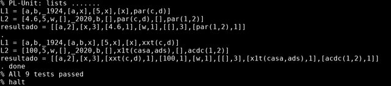

Aluno | R.A.
-- | ---
Lorhan Sohaky | 740951
Thaís Dordan | 743596

# Algoritmo Geral
A ideia para resolver o problema proposto é:

1. Receber L1 e L2:  Entrada para o algoritmo;
2. Normalizar L1 e L2: Remover sub-listas e variáveis;
3. Fazer a diferença entre L1 e L2 (L1 - L2) e guardar em M1: Pegar os valores que estão em L1, mas não estão em L2;
4. Fazer a diferença entre L2 e L1 (L2 - L1) e guardar em M2: Pegar os valores que estão em L2, mas não estão em L1;
5. Concatenar M1 com M2 e guardar em N2: Obter uma lista com os elementos que não fazem parte da intersecção de M1 com M2;
6. Remover elementos repetidos de N2 e guardar em N1: Obter uma lista sem repetição dos elementos que não estão na intersecção de M1 com M2.
7. Contar a quantidade de vezes que cada elemento de N1 aparece em N2: Produzir uma lista da seguinte maneira `[[item1,quantidade], [item2,quantidade], ...]` .

# `main`
Predicado principal que lê as entradas, executa o `conta_atomos( L1, L2, L3 )` e apresenta o resultado na tela.

# `conta_atomos(L1, L2, Lout)`
Conta a quantidade de vezes que os itens, que não são variáveis, aparecem em apenas `L1` ou apenas em `L2`.

## `normalize(L1,L2)`
Remove as sub-listas e as variáveis de `L1` e armazena o resultado em `L2`. Para normalizar é necessária a operação `concat(L1,L2,L3)` para remover as sub-listas e colocar seus elementos como itens da lista.

### `concat( L1, L2, L3 )`
Concatena as listas `L1` e `L2` e armazena o resultado em  `L3`.

## `minus(L1, L2, L3)`
Todo item de `L1` que não pertence à `L2` é adicionado à `L3`, ou seja, é realizada a diferença de conjuntos.

## `in(X, List)`
Verifica se `X` pertence à `List`.

## `removeRepeated(L1, L2)`
Remove os itens repetidos de `L1` e armazena o resultado em `L2`.

## `countList(L1, L2, L3)`
Conta a quantidade de vezes que os itens de `L1` aparecem na lista `L2` e o resultado é armazenado em `L3` no formato `[[item1,quantidade], [item2,quantidade], ...]`. O predicado `countItem(X, List, Count)` é usado para calcular a quantidade de vezes que um determinado item de `L1` aparece na lista `L2`.

### `countItem(X, List, Count)`
Conta a quantidade de vezes que um item `X` aparece na lista `List` e resultado está disponível em `Count`.

# Código implementado
```prolog
concat([], L, L) :- !.
concat([X|Y], L, [X|Z]) :-
    concat(Y, L, Z).

normalize([], []) :- !.
normalize([X|Y], Z) :-
    is_list(X),
    compound(X),
    concat(X, Y, L),
    normalize(L, Z), !.
normalize([X|Y], [X|Z]) :-
    not(var(X)),
    normalize(Y, Z), !.
normalize([_|Y], Z) :-
    normalize(Y, Z).

in(X, [X|_]) :- !.
in(X, [_|Y]) :-
    in(X, Y).

removeRepeated([], []) :- !.
removeRepeated([X|Y], [X|Z]) :-
    not(in(X, Y)),
    removeRepeated(Y, Z), !.
removeRepeated([_|Y], Z) :-
    removeRepeated(Y, Z).

countItem(_, [], 0) :- !.
countItem(X, [X|Y], Z) :-
    countItem(X, Y, W),
    Z is W+1, !.
countItem(X, [_|Y], Z) :-
    countItem(X, Y, Z), !.

countList([], L2, []) :-
    is_list(L2), !.
countList([X|Y], L2, [[X, Z]|W]) :-
    countItem(X, L2, Z),
    countList(Y, L2, W), !.

minus([], _, []) :- !.
minus([X|Y], Z, [X|W]) :-
    not(in(X, Z)),
    minus(Y, Z, W), !.
minus([_|Y], Z, W) :-
    minus(Y, Z, W).

conta_atomos(L1, L2, Lout) :-
    normalize(L1, M1),
    normalize(L2, M2),
    minus(M1, M2, O1),
    minus(M2, M1, O2),
    concat(O1, O2, O3),
    removeRepeated(O3, P1),
    countList(P1, O3, Lout).

main :-
    read(L1),
    read(L2),
    conta_atomos(L1, L2, L3),
    write(L3).
```

# Código de teste
```prolog
:- begin_tests(lists).
:- use_module(library(lists)).

test(concat1) :-
    concat([1, 2], [3, 4], L),
    L==[1, 2, 3, 4].

test(concat2) :-
    concat([1, [2], 3], [3, 4], L),
    L==[1, [2], 3, 3, 4].

test(normalize1) :-
    normalize([1, [2], [3, [4]], 5, [6, [7, [8], 9]], 10], L),
    L==[1, 2, 3, 4, 5, 6, 7, 8, 9, 10].

test(removeRepeated1) :-
    removeRepeated([1, 2, 2, 2, 2, 3, 3, 4, 5, 3, 3], L),
    L==[1, 2, 4, 5, 3].

test(countList1) :-
    countList([1, 2, 3, 4, 5], [1, 1, 1, 1, 1, 1, 2, 2, 2, 4, 1, 3, 6, 8, 4, 5, 7, 1, 3, 5], L),
    L==[[1, 8], [2, 3], [3, 2], [4, 2], [5, 2]].

test(minus1):-
    minus([1,2,3,4,5,6,3,1,10,4,3],[3,1,2,5,6,3,1,4,8],L),
    L==[10].

test(conta_atomos1) :-
    L1 = [a, b, Z,[a, x], [5,x], [x], par(c,d)],
    L2 = [4.6, 5, w, [], F, b, [], par(c,d), [], par(1,2)],
    conta_atomos(L1,L2, L3),
    nl(),
    write('L1 = '),
    write(L1),
    nl(),
    write('L2 = '),
    write(L2),
    nl(),
    write('resultado = '),
    write(L3),
    nl(),
    L3==[[a, 2], [x, 3], [4.6, 1],[w,1],[[], 3], [par(1,2), 1]].


test(conta_atomos2) :-
    L1 = [a, b, Z,[a,b, x], [5,x], [x], xxt(c,d)],
    L2 = [100, 5, w, [], F, b, [], x1t(casa,ads), [], acdc(1,2)],
    conta_atomos(L1,L2, L3),
    nl(),
    write('L1 = '),
    write(L1),
    nl(),
    write('L2 = '),
    write(L2),
    nl(),
    write('resultado = '),
    write(L3),
    nl(),
    L3==[[a,2],[x,3],[xxt(c,d),1],[100,1],[w,1],[x1t(casa,ads),1],[[],3],[acdc(1,2),1]].

:- end_tests(lists).
```

# Resultado dos testes
