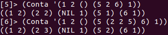
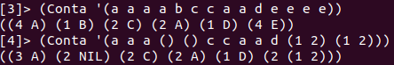

Aluno | R.A.
-- | ---
Lorhan Sohaky | 740951
Thaís Dordan | 743596
# Problema 1
## Algoritmo Geral

A ideia para resolver o problema proposto é:

1. Desparentizar a lista
2. Contar a quantidade de vezes que cada elemento aparece na lista desparentizada
3. Produzir uma saída da seguinte maneira `((Átomo1 Quantidade1) (Átomo2 Quantidade2) ...)`

### `Desparentiza (Lista)`
Recebe como entrada uma lista `Lista` e move todos os subníveis dessa lista para o primeiro nível. Retorna uma lista com todos os elementos no primeiro nível.

### `esta-em (A Lista)`
Recebe como entrada um átomo `A` e uma lista `Lista` da seguinte maneira `((Átomo1 Quantidade1) (Átomo2 Quantidade2) ...)` e verifica se esse átomo está na lista. Retorna `t` para caso o elemento esteja na lista e `nil` caso contrário.

### `Conta (Lista)`
Recebe como entrada uma lista `Lista`, desparentiza a lista usando a função `Desparentiza` e logo após, para cada átomo dessa lista, conta quantas vezes ele aparece na mesma. Retorna uma lista no formato `((Átomo1 Quantidade1) (Átomo2 Quantidade2) ...)`. Antes de realizar a contagem, verifica se o átomo da `Lista` já está na lista de saída, utlizando a função `esta-em`.

## Código implementado
```lisp
(defun Desparentiza (Lista)
    (cond ((null Lista) nil)
        ((or (not (listp (car Lista))) (null (car Lista))) 
            (if (listp (car Lista)) 
                (cons () (Desparentiza (cdr Lista))) 
            (cons (car Lista) (Desparentiza (cdr Lista)))))
        (t (append (Desparentiza (car Lista)) (Desparentiza (cdr Lista))))))
        
(defun esta-em (A Lista)
    (cond ((null Lista) nil)
        ((equal (caar Lista) A) t)
        (t (esta-em A (cdr Lista)))))

(defun Conta (Lista)
    (progn (setq Lista (Desparentiza Lista))
        (do ((Aux Lista (cdr Aux)) (res ()))
            ((null Aux) res)
            (if (not (esta-em (car Aux) res))
                (setq res (append res (list (list (car Aux) 
                    (do ((Aux2 Aux (cdr Aux2)) (R 0))
                        ((null Aux2) R)
                        (if (equal (car Aux) (car Aux2))
                            (setq R (+ R 1))))))))))))
```

## Resultado dos testes


# Problema 2
## Algoritmo Geral

A ideia para resolver o problema proposto é:

1. Contar a quantidade de vezes que cada elemento aparece consecutivamente na lista principal
2. Verificar se o último elemento da lista produzida é igual ao elemento atual
3. Produzir uma saída da seguinte maneira `((Quantidade1 Elemento1) (Quantidade2 Elemento2) ...)`

### `esta-em (A Lista)`
Recebe como entrada um elemento `A`, tanto átomo como lista, e uma lista `Lista` da seguinte maneira `((Quantidade1 Elemento1) (Quantidade2 Elemento2) ...)` e verifica se esse elemento é igual ao último elemento da lista. Retorna `t` para caso o elemento `A` seja igual ao último elemento da lista de saída e `nil` caso contrário. Essa função é utilizada para evitar que o mesmo elemento consecutivo seja contabilizado e produzido na saída.

### `Conta (Lista)`
Recebe como entrada uma lista `Lista` e, para cada elemento dessa lista, conta quantas vezes ele aparece em sequência. Retorna uma lista no formato `((Quantidade1 Elemento1) (Quantidade2 Elemento2) ...)`. Antes de realizar a contagem, verifica se o elemento da `Lista` é igual ao último elemento da lista de saída, utlizando a função `esta-em`.

## Código implementado
```lisp
(defun esta-em (A Lista)
        (cond ((null Lista) nil)
            ((not (null (cdr Lista))) (esta-em A (cdr Lista)))
            ((equal (cadar Lista) A) A)))

(defun Conta (Lista)
    (do ((Aux Lista (cdr Aux)) (res ()))
        ((null Aux) res)
        (if (not (esta-em (car Aux) res))
            (setq res (append res (list (list 
                (do ((Aux2 Aux (cdr Aux2)) (R 0))
                    ((or (null Aux2) (not (equal (car Aux) (car Aux2)))) R)
                    (if (equal (car Aux) (car Aux2))
                        (setq R (+ R 1))))  (car Aux))))))))
```

## Resultado dos testes

